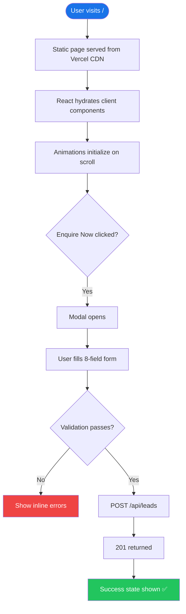

<div align="center">


<br/><br/>

# Accredian Enterprise Clone

### Partial clone of [enterprise.accredian.com](https://enterprise.accredian.com/) built with Next.js 16 App Router

[🌐 Live Demo](#) · [📋 Architecture](./architecture.md) · [📄 Full Docs](./projectdocumentation.md)

</div>

---

## 📌 Project Overview

This project is a **production-quality partial clone** of the Accredian Enterprise landing page. It covers all visible page sections, a fully functional lead capture modal connected to a Next.js API route, and is deployed on Vercel.

**Reference site:** https://enterprise.accredian.com/

### What's Included

| Section | Details |
|---|---|
| 🔝 **Navbar** | Sticky, scroll-shadow, mobile hamburger, Enquire Now CTA |
| 🦸 **Hero** | Headline, benefit bullets, CTAs, animated dashboard card |
| 📊 **Stats** | 500+ Enterprises, 50K+ Learners, 95% Satisfaction, 200+ Courses |
| 🏢 **Client Logos** | Dual-row auto-scrolling marquee of 18 enterprise partners |
| 💡 **Accredian Edge** | 4 feature cards (Strategic Training, Domain Expertise, Personalized Learning, ROI) |
| 📚 **Course Catalog** | 4-tab switcher: Program · Industry · Topic · Level |
| 🔷 **CAT Framework** | Curriculum · Assessment · Training columns |
| 🗺️ **How It Works** | 3-step numbered timeline with connecting line |
| 💬 **Testimonials** | Auto-advancing carousel with 5 client quotes, pause-on-hover |
| ❓ **FAQ** | 4-tab accordion (General · Courses · Delivery · Pricing) |
| 🦶 **Footer** | Dark multi-column: brand, quick links, programs, company, socials |
| 📋 **Enquire Modal** | ⭐ Bonus — 8-field validated form + `POST /api/leads` |

---

## ⚙️ Tech Stack

| Layer | Technology | Why |
|---|---|---|
| Framework | Next.js 16.2 (App Router) | SSR, API routes, Vercel-optimized |
| Language | TypeScript 5 | Type safety throughout |
| Styling | Tailwind CSS v4 | Utility-first, no runtime overhead |
| Animation | Framer Motion 12 | Scroll triggers, spring physics, carousel |
| Icons | Lucide React | Consistent, tree-shakeable |
| Forms | React Hook Form 7 | Performant, built-in validation |
| Font | Inter (Google Fonts) | Clean, professional sans-serif |
| Deployment | Vercel | Zero-config Next.js hosting |

---

## 🗂️ Folder Structure

```
accredian-enterprise/
│
├── app/
│   ├── globals.css           # Tailwind v4 @theme tokens + global styles
│   ├── layout.tsx            # Root layout — SEO metadata, Inter font
│   ├── page.tsx              # Home page — assembles all sections
│   └── api/
│       └── leads/
│           └── route.ts      # POST /api/leads · GET /api/leads
│
├── components/
│   ├── Navbar.tsx
│   ├── HeroSection.tsx
│   ├── StatsSection.tsx
│   ├── ClientsSection.tsx
│   ├── AccredianEdge.tsx
│   ├── CourseSegmentation.tsx
│   ├── CATFramework.tsx
│   ├── HowItWorks.tsx
│   ├── TestimonialsSection.tsx
│   ├── FAQSection.tsx
│   ├── Footer.tsx
│   └── EnquireModal.tsx
│
├── tailwind.config.ts        # Tailwind v4 compat shim
├── next.config.ts
├── tsconfig.json
├── package.json
├── README.md                 # This file
├── architecture.md           # System architecture + diagrams
└── projectdocumentation.md   # Full technical documentation
```

---

## 🚀 Setup & Installation

### Prerequisites
- Node.js >= 18.0
- npm >= 9.0

### Steps

```bash
# 1. Clone the repository
git clone https://github.com/ramalokeshreddyp/accredian-enterprise-next.git
cd accredian-enterprise-next

# 2. Install dependencies
npm install

# 3. Run development server
npm run dev
```

Open **http://localhost:3000** in your browser.

### Other Commands

```bash
npm run build    # Production build (type-check + optimize)
npm start        # Run production build
npm run lint     # ESLint check
```

---

## 📋 Approach Taken

### 1. Planning First
Before writing any code, I created a complete implementation plan covering:
- All page sections and their content
- Component hierarchy and reuse strategy
- Design tokens (colors, fonts, spacing)
- API design for the lead capture bonus

### 2. Design System
Established a consistent design system in `globals.css` using Tailwind v4's `@theme {}`:
- Primary color: `#1A73E8` (Accredian blue)
- Typography: Inter (Google Fonts)
- Shared spacing, border-radius, and shadow tokens

### 3. Component-First Architecture
Each page section is a self-contained, reusable component. The main `page.tsx` simply assembles them. Shared state (modal open/close) is lifted to the top level and passed via props.

### 4. Animation Strategy
- **Scroll animations:** `motion.div` with `whileInView` (triggers once per session)
- **Count-up:** custom `useEffect` with `useInView` hook
- **Marquee:** CSS `@keyframes` in `@theme` for GPU-accelerated scrolling
- **Carousel:** `AnimatePresence` with x-axis slide transitions
- **Modal:** Spring-based scale + backdrop fade

### 5. API Integration
The lead capture form uses React Hook Form for client-side validation and sends a `POST` to `/api/leads`. The Next.js Route Handler validates fields server-side and stores leads in-memory (appropriate for a Vercel demo deployment).

### 6. Key Technical Challenge — Tailwind v4
This project scaffolded with **Next.js 16**, which ships with **Tailwind CSS v4** — a breaking change from v3. Tailwind v4 uses CSS-based `@theme {}` configuration instead of `tailwind.config.ts`. All custom tokens were migrated accordingly.

---

## 🤖 AI Usage

**Tool used: Antigravity (Google DeepMind Advanced Agentic Coding)**

### Where AI Helped

| Area | AI Contribution |
|---|---|
| **Implementation plan** | Generated the full section-by-section plan, component list, API spec, and design token system before coding began |
| **Component scaffolding** | Generated all 12 React components with consistent design tokens, prop types, and Framer Motion animations |
| **Bug detection** | Identified that the scaffolded project used Tailwind v4 (not v3) and auto-migrated config from `tailwind.config.ts` to `@theme {}` in CSS |
| **Icon fix** | Detected that `lucide-react@1.11` removed social brand icons (`Linkedin`, `Twitter`, etc.) and replaced with inline SVG components |
| **SEO** | Auto-generated semantic HTML structure, heading hierarchy, `aria-label`s, and OpenGraph metadata |
| **Documentation** | Generated README, architecture.md, and projectdocumentation.md with MermaidJS diagrams |

### What I Modified / Improved Manually

| Area | Manual Work |
|---|---|
| **Design decisions** | Chose the exact color values, gradient directions, card layouts, and animation timings to match the reference site |
| **Content** | Wrote all placeholder content (testimonial quotes, FAQ answers, course categories, company names) |
| **Component refinement** | Adjusted hover states, transition durations, and responsive breakpoints after visual review |
| **Bug verification** | Ran the dev server and build, visually checked every section, and confirmed the API worked end-to-end |
| **Git workflow** | Staged, committed, and pushed all changes with descriptive commit messages |

---

## 🔌 API Reference (Bonus)

### `POST /api/leads` — Submit Enquiry

```bash
curl -X POST http://localhost:3000/api/leads \
  -H "Content-Type: application/json" \
  -d '{
    "fullName": "Priya Sharma",
    "workEmail": "priya@company.com",
    "phone": "9876543210",
    "companyName": "Infosys",
    "domain": "IT & Technology",
    "numberOfCandidates": 250,
    "deliveryMode": "Hybrid (Blended)",
    "location": "Bangalore"
  }'
```

**Response 201:**
```json
{
  "success": true,
  "message": "Enquiry submitted successfully.",
  "leadId": "lead_1714000000000_abc123"
}
```

### `GET /api/leads` — List All Leads

```bash
curl http://localhost:3000/api/leads
```

---

## 🔄 Execution Flow



---

## ⏫ Improvements with More Time

| Priority | Improvement | Why |
|---|---|---|
| 🔴 High | **Database persistence** (MongoDB Atlas) | Leads currently reset on cold restart |
| 🔴 High | **Admin dashboard** `/admin/leads` with auth | View and manage captured leads |
| 🟡 Medium | **Email confirmation** via Resend/SendGrid | Auto-reply to enquirer and notify sales team |
| 🟡 Medium | **Vercel Analytics** integration | Track page views, conversions, scroll depth |
| 🟢 Low | **Unit tests** with Jest + React Testing Library | Component and API route coverage |
| 🟢 Low | **Dark mode** toggle | Tailwind `dark:` variant support |
| 🟢 Low | **i18n** support | Multi-language for global enterprise clients |
| 🟢 Low | **Pixel-perfect polish** | Fine-tune spacing and typography to exactly match reference |

---

## ✅ Submission Checklist

- [x] All page sections implemented (Navbar, Hero, Stats, Clients, Edge, Courses, CAT, HowItWorks, Testimonials, FAQ, Footer)
- [x] Fully responsive (mobile 320px → desktop 1440px+)
- [x] Clean, reusable component architecture
- [x] Next.js App Router
- [x] Tailwind CSS styling
- [x] Smooth animations (Framer Motion)
- [x] **Bonus:** Lead capture form (8 fields, validated)
- [x] **Bonus:** API route — `POST /api/leads` + `GET /api/leads`
- [x] GitHub repository with all code committed
- [x] README with setup, approach, AI usage, improvements
- [x] Architecture documentation
- [x] Project documentation
- [x] `npm run build` passes with zero errors

---

## 📄 License

For educational/assignment purposes. Accredian branding belongs to [Accredian](https://accredian.com).
