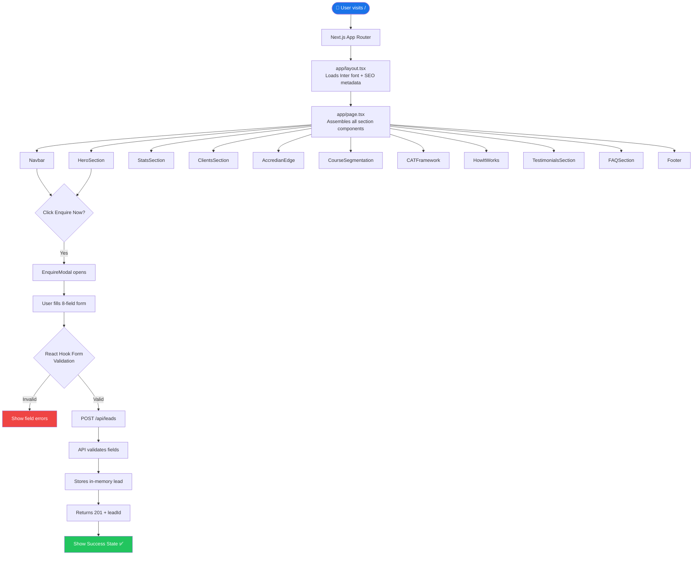
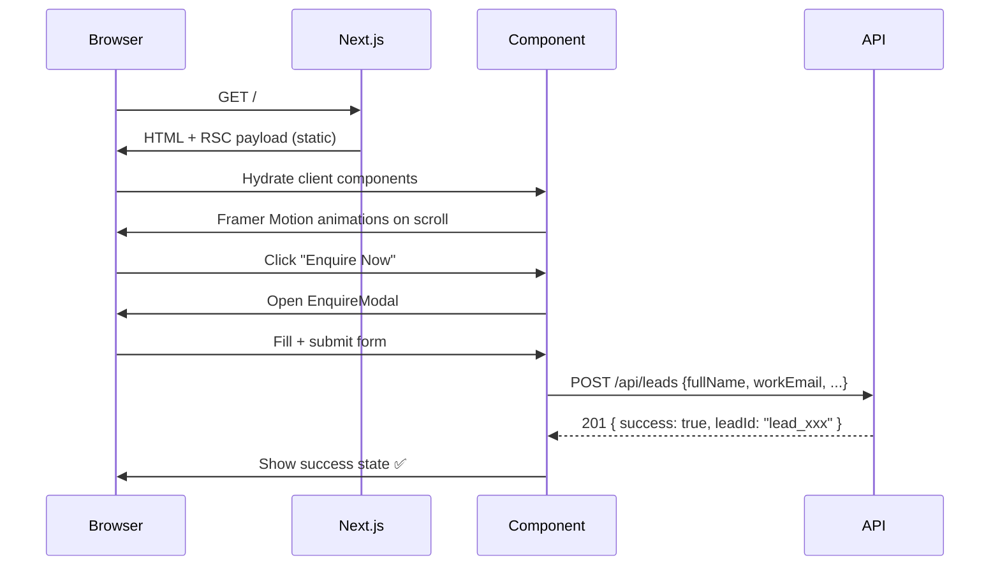

<div align="center">


<br/><br/>

# 🚀 Accredian Enterprise Clone

### *A pixel-perfect, production-ready clone of the Accredian Enterprise landing page*

> Built with **Next.js 16 App Router** · **Tailwind CSS v4** · **Framer Motion** · **React Hook Form** · **TypeScript**

<br/>

[🌐 Live Demo](https://github.com/ramalokeshreddyp/accredian-enterprise-next) · [📋 Architecture](./architecture.md) · [📄 Documentation](./projectdocumentation.md) · [🐛 Report Bug](https://github.com/ramalokeshreddyp/accredian-enterprise-next/issues)

</div>

---

## 📸 Preview

| Section | Description |
|---|---|
| 🏠 **Hero** | Gradient background, animated dashboard card, floating badges |
| 📊 **Stats** | Scroll-triggered count-up: 500+ Enterprises, 50K+ Learners |
| 🏢 **Clients** | Dual-row auto-scrolling marquee of enterprise partners |
| 💡 **Accredian Edge** | 4 feature cards with hover-lift animations |
| 📚 **Course Catalog** | 4-tab switcher: Program · Industry · Topic · Level |
| 🔷 **CAT Framework** | Curriculum · Assessment · Training columns |
| 🗺️ **How It Works** | 3-step numbered timeline |
| 💬 **Testimonials** | Auto-advancing carousel with pause-on-hover |
| ❓ **FAQ** | Tabbed accordion with smooth animation |
| 🦶 **Footer** | Dark multi-column footer with social icons |
| 📋 **Enquire Modal** | 8-field validated lead capture form + API |

---

## 🗂️ Project Structure

```
accredian-enterprise/
│
├── 📁 app/                          # Next.js App Router
│   ├── globals.css                  # Tailwind v4 @theme config + global styles
│   ├── layout.tsx                   # Root layout — SEO metadata, fonts
│   ├── page.tsx                     # Main page — assembles all sections
│   └── 📁 api/
│       └── 📁 leads/
│           └── route.ts             # POST /api/leads + GET /api/leads
│
├── 📁 components/                   # Reusable React components
│   ├── Navbar.tsx                   # Sticky nav with mobile hamburger
│   ├── HeroSection.tsx              # Hero with animated dashboard
│   ├── StatsSection.tsx             # Count-up stat cards
│   ├── ClientsSection.tsx           # Dual marquee partner logos
│   ├── AccredianEdge.tsx            # Feature cards
│   ├── CourseSegmentation.tsx       # Tab-based course catalog
│   ├── CATFramework.tsx             # 3-pillar framework
│   ├── HowItWorks.tsx               # Step timeline
│   ├── FAQSection.tsx               # Tabbed accordion FAQ
│   ├── TestimonialsSection.tsx      # Auto-carousel reviews
│   ├── Footer.tsx                   # Dark footer
│   └── EnquireModal.tsx             # Lead capture modal form
│
├── tailwind.config.ts               # Tailwind v4 compatibility shim
├── next.config.ts                   # Next.js config
├── tsconfig.json                    # TypeScript config
├── package.json                     # Dependencies
├── README.md                        # This file
├── architecture.md                  # System architecture doc
└── projectdocumentation.md          # Full project documentation
```

---

## ⚙️ Tech Stack

| Layer | Technology | Purpose |
|---|---|---|
| **Framework** | Next.js 16.2 (App Router) | SSR, file-based routing, API routes |
| **Language** | TypeScript 5 | Type-safe development |
| **Styling** | Tailwind CSS v4 | Utility-first CSS with `@theme` config |
| **Animation** | Framer Motion 12 | Page transitions, scroll animations, carousel |
| **Icons** | Lucide React | Clean, consistent icon set |
| **Forms** | React Hook Form 7 | Performant, validated form management |
| **Fonts** | Inter (Google Fonts) | Modern, readable sans-serif |
| **Deployment** | Vercel | Zero-config Next.js hosting |

---

## 🔄 Execution Flow



---

## 🏗️ Component Architecture

```mermaid
graph TD
    PG[page.tsx\nClient Component] -->|state: modalOpen| NB[Navbar]
    PG -->|state: modalOpen| HS[HeroSection]
    PG --> SS[StatsSection]
    PG --> CS[ClientsSection]
    PG --> AE[AccredianEdge]
    PG --> CSG[CourseSegmentation]
    PG --> CAT[CATFramework]
    PG --> HIW[HowItWorks]
    PG --> TS[TestimonialsSection]
    PG --> FAQ[FAQSection]
    PG --> FT[Footer]
    PG -->|isOpen/onClose| EM[EnquireModal]

    NB -->|onClick| PG
    HS -->|onClick| PG

    EM -->|POST| API[/api/leads\nRoute Handler]
    API -->|201 + leadId| EM

    style PG fill:#1A73E8,color:#fff
    style API fill:#7c3aed,color:#fff
    style EM fill:#0f766e,color:#fff
```

---

## 🌐 Page Sections Flow



---

## 🚀 Getting Started

### Prerequisites

```bash
node -v   # >= 18.0.0
npm -v    # >= 9.0.0
```

### Installation

```bash
# 1. Clone the repository
git clone https://github.com/ramalokeshreddyp/accredian-enterprise-next.git
cd accredian-enterprise-next

# 2. Install dependencies
npm install

# 3. Start development server
npm run dev
```

Open [http://localhost:3000](http://localhost:3000) in your browser.

### Available Scripts

| Command | Description |
|---|---|
| `npm run dev` | Start development server at localhost:3000 |
| `npm run build` | Build for production (type-checks + optimization) |
| `npm start` | Run the production build |
| `npm run lint` | Run ESLint on all files |

---

## 🔌 API Reference

### `POST /api/leads` — Submit Enquiry

**Endpoint:** `/api/leads`  
**Method:** `POST`  
**Content-Type:** `application/json`

**Request Body:**
```json
{
  "fullName": "Priya Sharma",
  "workEmail": "priya@infosys.com",
  "phone": "9876543210",
  "companyName": "Infosys",
  "domain": "IT & Technology",
  "numberOfCandidates": 250,
  "deliveryMode": "Hybrid (Blended)",
  "location": "Bangalore"
}
```

**Response `201`:**
```json
{
  "success": true,
  "message": "Enquiry submitted successfully. Our team will reach out within 1 business day.",
  "leadId": "lead_1714000000000_abc123xyz"
}
```

**Response `400` (missing fields):**
```json
{
  "success": false,
  "message": "Missing required fields"
}
```

### `GET /api/leads` — List All Leads (Admin)

**Response `200`:**
```json
{
  "success": true,
  "count": 3,
  "leads": [ { "id": "...", "fullName": "...", "createdAt": "..." } ]
}
```

---

## 🎨 Design System

| Token | Value |
|---|---|
| **Primary Blue** | `#1A73E8` |
| **Primary Dark** | `#1557B0` |
| **Dark Text** | `#202124` |
| **Body Text** | `#3C4043` |
| **Muted** | `#5F6368` |
| **Surface** | `#F8F9FA` |
| **Border** | `#E8EAED` |
| **Font** | Inter (Google Fonts) |
| **Border Radius** | 8px – 16px |
| **Animation** | Framer Motion (spring + ease) |

---

## 🌐 Deployment (Vercel)

```bash
# Push to GitHub
git push origin main

# Then import on Vercel:
# 1. Go to vercel.com/new
# 2. Import: ramalokeshreddyp/accredian-enterprise-next
# 3. Click Deploy — no config needed
```

> ⚠️ **Lead storage is in-memory** and resets on cold starts. For production, replace with a database (MongoDB Atlas, PlanetScale, or Upstash Redis).

---

## 📋 Verification Checklist

- [x] All 11 sections render correctly
- [x] Sticky navbar with scroll shadow
- [x] Mobile hamburger menu works
- [x] Count-up animations trigger on scroll
- [x] Marquee scrolls continuously
- [x] Course tab switching works with animation
- [x] FAQ accordion expands/collapses smoothly
- [x] Testimonials auto-advance and pause on hover
- [x] Enquire modal opens from navbar and hero CTA
- [x] Form validation shows per-field errors
- [x] Form submits → API returns 201 → success state shown
- [x] `npm run build` passes with zero errors
- [x] Fully responsive (320px → 1440px+)

---

## 🤖 AI Tool Usage

This project was developed with **Antigravity AI** (Google DeepMind). Key AI contributions:

1. **Architecture Planning** — AI produced a complete implementation plan with component hierarchy, API design, and design tokens before writing a single line of code
2. **Component Generation** — All 12 React components were generated maintaining consistent design tokens across files
3. **Tailwind v4 Migration Fix** — AI identified that the project scaffolded with Tailwind v4 (not v3) and migrated the config from `tailwind.config.ts` to `@theme {}` in `globals.css`
4. **Bug Fix: Lucide Icons** — AI detected that `lucide-react@1.11` removed social brand icons and replaced them with inline SVGs
5. **SEO & Accessibility** — Semantic HTML, unique IDs on all interactive elements, OpenGraph metadata, heading hierarchy

---

## 📄 License

This project is for educational/portfolio purposes. All Accredian branding belongs to [Accredian](https://accredian.com).

---

<div align="center">

Made with ❤️ using Next.js, Tailwind CSS, and Framer Motion

</div>
