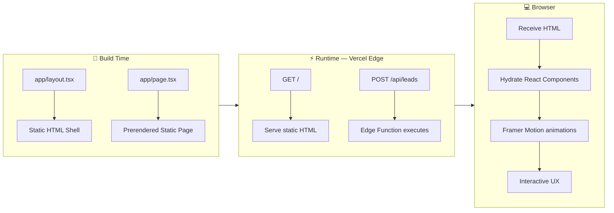
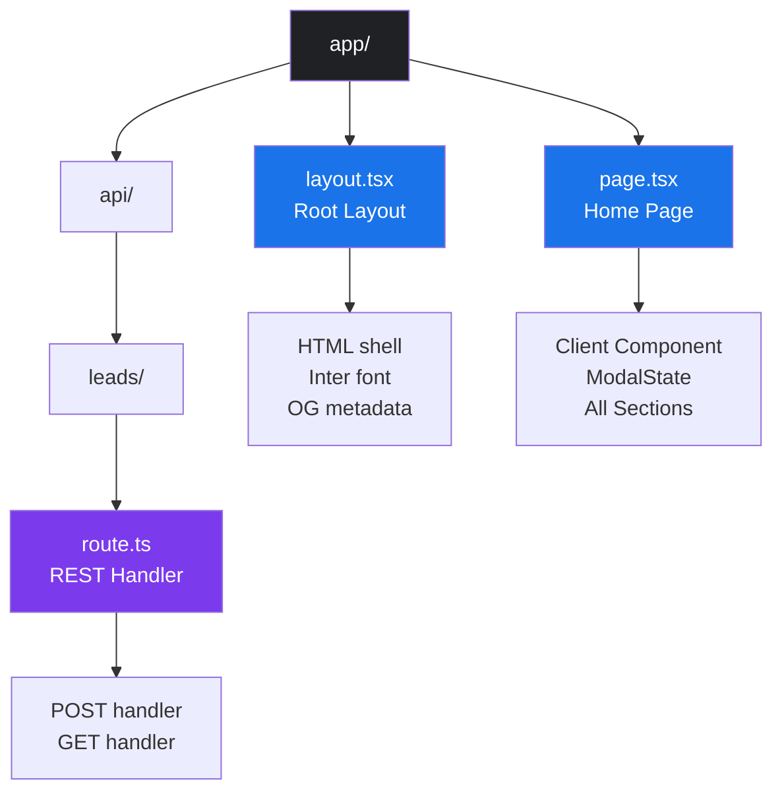
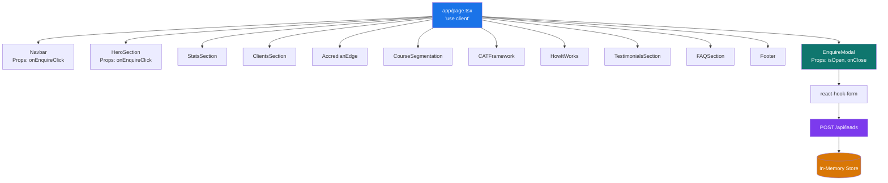
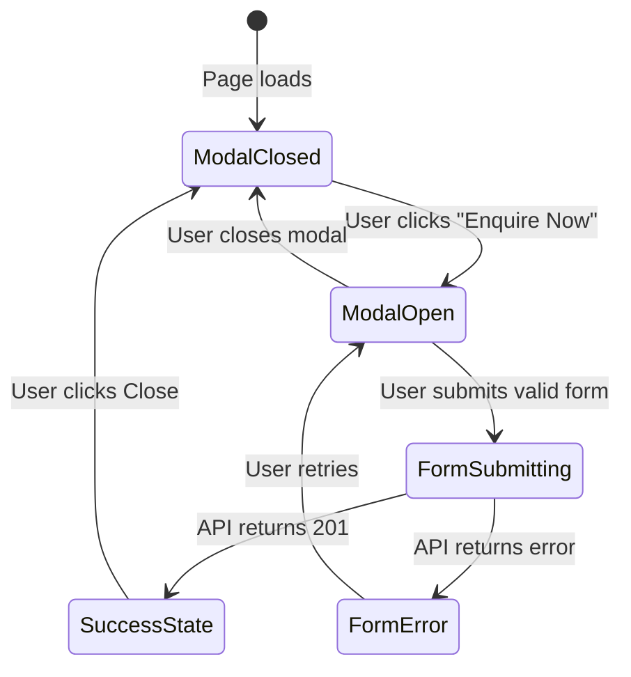
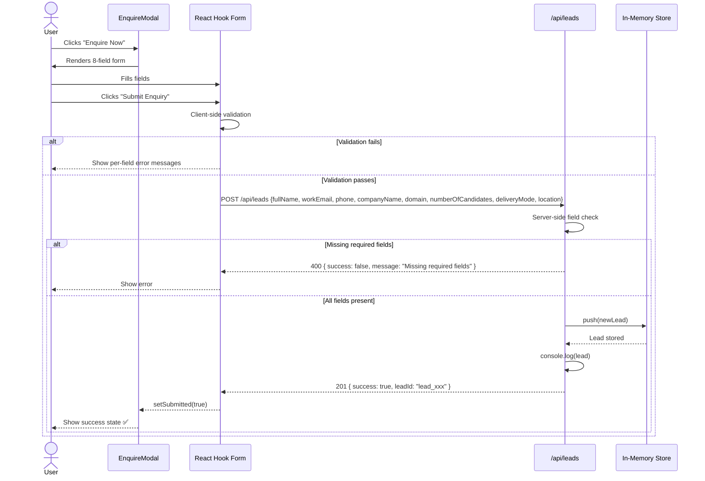
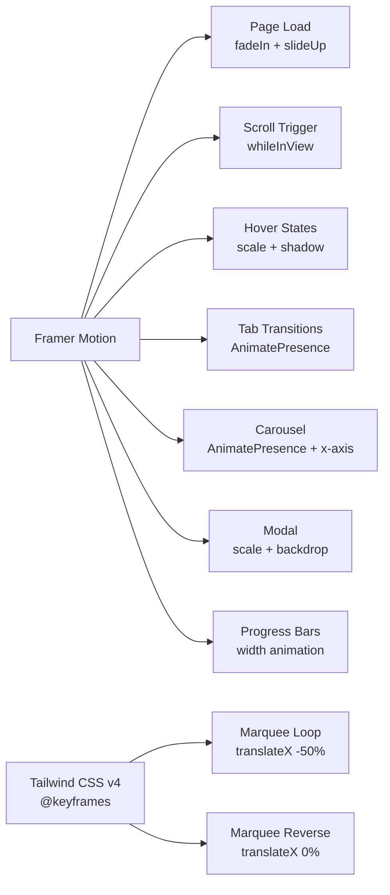
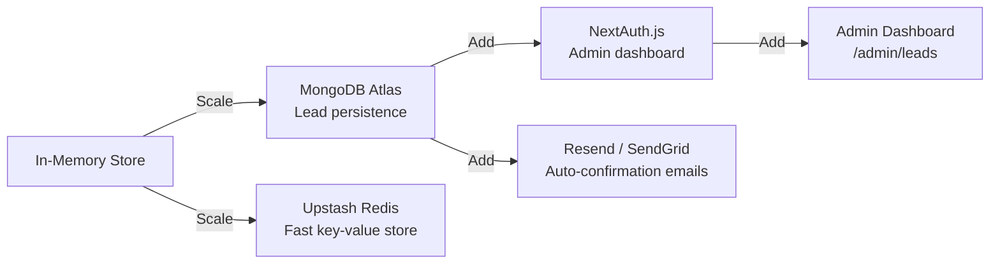

# 🏗️ Architecture — Accredian Enterprise Clone

> System architecture, component design, data flow, and infrastructure for the Accredian Enterprise Clone built with Next.js 16 App Router.

---

## 1. System Overview

The Accredian Enterprise Clone is a **single-page application (SPA) built on the Next.js App Router**, combining static rendering for maximum performance with client-side interactivity. It features an integrated API layer for lead capture.

```
┌─────────────────────────────────────────────────────────────────────┐
│                        CLIENT BROWSER                               │
│                                                                     │
│  ┌──────────────────────────────────────────────────────────────┐   │
│  │                React Client Components                       │   │
│  │  Navbar │ HeroSection │ StatsSection │ ... │ EnquireModal   │   │
│  └──────────────────────────────┬───────────────────────────────┘   │
│                                 │ fetch() POST                      │
└─────────────────────────────────┼───────────────────────────────────┘
                                  │
                                  ▼
┌─────────────────────────────────────────────────────────────────────┐
│                    NEXT.JS SERVER (Vercel Edge)                     │
│                                                                     │
│  ┌─────────────────┐     ┌───────────────────────────────────────┐  │
│  │  Static Export  │     │         API Route Handler             │  │
│  │  app/page.tsx   │     │    /api/leads (route.ts)              │  │
│  │  (prerendered)  │     │    POST → validate → store → 201      │  │
│  └─────────────────┘     │    GET  → return all leads            │  │
│                          └───────────────────────────────────────┘  │
│                                        │                            │
│                          ┌─────────────▼──────────────┐            │
│                          │    In-Memory Lead Store     │            │
│                          │    leads: Lead[]            │            │
│                          └────────────────────────────┘            │
└─────────────────────────────────────────────────────────────────────┘
```

---

## 2. Application Architecture

### 2.1 Rendering Strategy



### 2.2 Next.js App Router Structure



---

## 3. Component Architecture

### 3.1 Component Tree



### 3.2 State Management



---

## 4. Data Flow Architecture

### 4.1 Lead Capture Flow



### 4.2 API Data Schema

```typescript
interface Lead {
  id: string;             // "lead_{timestamp}_{random}"
  fullName: string;       // Required
  workEmail: string;      // Required
  phone: string;          // Required
  companyName: string;    // Required
  domain: string;         // Required — dropdown
  numberOfCandidates: number; // Required
  deliveryMode: string;   // Required — dropdown
  location: string;       // Optional
  createdAt: string;      // ISO 8601 timestamp
}
```

---

## 5. Frontend Architecture

### 5.1 Animation Architecture



### 5.2 Tailwind CSS v4 Theme Architecture

```
globals.css
└── @import "tailwindcss"
└── @theme {
        --color-primary: #1A73E8
        --color-primary-dark: #1557B0
        --color-dark: #202124
        --color-body: #3C4043
        --color-muted: #5F6368
        --color-surface: #F8F9FA
        --color-border: #E8EAED
        --font-family-sans: "Inter"
        --animate-marquee: marquee 30s linear infinite
        --animate-marquee-reverse: marqueeReverse 30s linear infinite
        @keyframes marquee { ... }
        @keyframes marqueeReverse { ... }
    }
```

> **Note:** Tailwind v4 uses CSS-based `@theme {}` configuration instead of `tailwind.config.ts`. Custom design tokens are declared as CSS custom properties.

---

## 6. Infrastructure & Deployment

### 6.1 Deployment Architecture

```mermaid
graph TD
    DEV[👨‍💻 Developer\nLocal Machine] -->|git push| GH[GitHub\nramalokeshreddyp/accredian-enterprise-next]
    GH -->|Webhook trigger| VB[Vercel Build System]
    VB -->|npm run build| NB[Next.js Build]
    NB -->|Static export| CDN[Vercel CDN\nGlobal Edge Network]
    NB -->|Serverless function| SF[/api/leads\nEdge Function]
    CDN -->|Serve HTML/CSS/JS| USER[🌍 End Users]
    SF -->|API responses| USER

    style DEV fill:#202124,color:#fff
    style GH fill:#333,color:#fff
    style VB fill:#000,color:#fff
    style CDN fill:#1A73E8,color:#fff
    style SF fill:#7c3aed,color:#fff
    style USER fill:#22c55e,color:#fff
```

### 6.2 Build Output

```
Route (app)
┌ ○ /            → Static prerendered HTML
├ ○ /_not-found  → Static 404 page
└ ƒ /api/leads   → Dynamic serverless function

○  Static    — served from CDN edge (instant)
ƒ  Dynamic   — server-rendered on demand (API)
```

---

## 7. Security Architecture

| Concern | Approach |
|---|---|
| **Input Validation** | Client-side: React Hook Form rules. Server-side: field presence check |
| **XSS Prevention** | React's built-in JSX escaping |
| **HTTPS** | Enforced by Vercel on all deployments |
| **No Auth Required** | Public landing page — no sensitive user data stored |
| **Email Privacy** | No third-party analytics or tracking SDKs included |

---

## 8. Performance Architecture

| Technique | Implementation |
|---|---|
| **Static Generation** | Home page prerendered at build time |
| **Code Splitting** | Next.js automatic per-route splitting |
| **Font Optimization** | `rel="preconnect"` + Google Fonts with `display=swap` |
| **CSS Purging** | Tailwind v4 automatically removes unused classes |
| **Animation Performance** | Framer Motion uses CSS `transform` (GPU-accelerated) |
| **Lazy Hydration** | `whileInView` triggers animations only when scrolled into view |

---

## 9. Scalability Considerations

### Current (MVP / Demo)
- In-memory lead store (resets on cold start)
- Single-instance state

### Production Upgrade Path



---

## 10. Technology Decision Matrix

| Technology | Why Chosen | Alternative Considered |
|---|---|---|
| Next.js 16 | App Router, built-in API routes, Vercel-optimized | Vite + Express |
| Tailwind CSS v4 | Utility-first, purges unused CSS, v4 CSS-based config | Styled Components |
| Framer Motion | Declarative animations, `whileInView`, spring physics | CSS animations only |
| React Hook Form | Zero-dependency, performant, easy validation | Formik |
| Lucide React | Tree-shakeable, consistent icon design | Heroicons |
| TypeScript | Compile-time type safety, better DX | JavaScript |
| Vercel | Zero-config Next.js deploy, global CDN | AWS Amplify |
