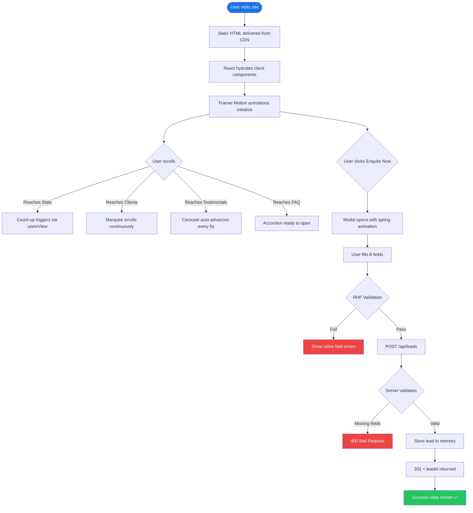

# 📄 Project Documentation — Accredian Enterprise Clone

> Complete technical documentation covering objectives, modules, workflow, and implementation details.

---

## 1. Project Overview

| Field | Detail |
|---|---|
| **Project Name** | Accredian Enterprise Clone |
| **Type** | Corporate Landing Page + Lead Capture System |
| **Framework** | Next.js 16.2 (App Router) |
| **Language** | TypeScript 5 |
| **Styling** | Tailwind CSS v4 |
| **Deployment** | Vercel |
| **Repository** | [GitHub](https://github.com/ramalokeshreddyp/accredian-enterprise-next) |

### Objective

Clone the [enterprise.accredian.com](https://enterprise.accredian.com/) landing page with a pixel-close design, full responsiveness, smooth animations, and a functional lead capture API — deployable to Vercel with zero configuration.

---

## 2. Problem Statement & Approach

### Problem
Building a production-quality enterprise landing page that:
- Matches a real-world design with multiple interactive sections
- Captures sales leads via a validated form connected to an API
- Deploys instantly to a CDN with no backend infrastructure to manage

### Approach
1. **Static-first rendering** — the entire page prebuilds at compile time for instant loads
2. **Client-side interactivity** — animations, tabs, carousels, and modal use React client components
3. **Serverless API** — a single Next.js Route Handler handles all lead capture without a separate backend

---

## 3. Key Modules

### 3.1 Navbar (`components/Navbar.tsx`)

**Responsibilities:**
- Sticky positioning with scroll-activated box-shadow
- Responsive: full nav links on desktop, hamburger menu on mobile
- "Enquire Now" CTA button triggers the modal via `onEnquireClick` prop

**Key Implementation:**
```typescript
const [scrolled, setScrolled] = useState(false);
useEffect(() => {
  const handleScroll = () => setScrolled(window.scrollY > 20);
  window.addEventListener("scroll", handleScroll);
}, []);
```

---

### 3.2 HeroSection (`components/HeroSection.tsx`)

**Responsibilities:**
- Full-viewport hero with gradient background
- Animated interactive dashboard card (right panel)
- Floating badges with perpetual motion animation
- Trust indicators (500+ Enterprises, 50K+ Learners, 95% Satisfaction)

**Animations:**
- `motion.div` with `initial/animate` for slide-up on load
- `motion.div` with `animate={{ y: [0, -8, 0] }}` for floating badges
- `motion.div` width animation for progress bars

---

### 3.3 StatsSection (`components/StatsSection.tsx`)

**Responsibilities:**
- 4 stat cards with animated count-up on scroll
- Uses `useInView` from Framer Motion to trigger only when visible

**Count-Up Logic:**
```typescript
useEffect(() => {
  if (!inView) return;
  const steps = 60;
  const increment = target / steps;
  let current = 0;
  const timer = setInterval(() => {
    current += increment;
    if (current >= target) { setCount(target); clearInterval(timer); }
    else setCount(Math.floor(current));
  }, 2000 / steps);
}, [inView, target]);
```

---

### 3.4 ClientsSection (`components/ClientsSection.tsx`)

**Responsibilities:**
- Dual-row continuously scrolling marquee of 18 enterprise client badges
- Row 1 scrolls left; Row 2 scrolls right for visual depth
- Each badge: gradient icon + company name

**CSS Animation (Tailwind v4 `@theme`):**
```css
@keyframes marquee {
  0%   { transform: translateX(0%); }
  100% { transform: translateX(-50%); }
}
```
The list is duplicated (`[...clients, ...clients]`) so the scroll loops seamlessly.

---

### 3.5 CourseSegmentation (`components/CourseSegmentation.tsx`)

**Responsibilities:**
- 4 tabs: Program · Industry · Topic · Level
- Each tab renders a 4-column card grid
- Tab switch uses `AnimatePresence` for smooth enter/exit

**State:**
```typescript
const [activeTab, setActiveTab] = useState<Tab>("Program");
```

**Tab data** covers 16 course categories across all 4 dimensions.

---

### 3.6 FAQSection (`components/FAQSection.tsx`)

**Responsibilities:**
- 4 topic tabs (General, Courses, Delivery, Pricing)
- Each tab has 3 accordion Q&A items
- Individual items use `AnimatePresence` + `height: 0 → auto` for smooth expand/collapse

**Accordion Pattern:**
```typescript
<AnimatePresence initial={false}>
  {open && (
    <motion.div
      initial={{ height: 0 }}
      animate={{ height: "auto" }}
      exit={{ height: 0 }}
      transition={{ duration: 0.3, ease: "easeInOut" }}
    >
```

---

### 3.7 TestimonialsSection (`components/TestimonialsSection.tsx`)

**Responsibilities:**
- 5 client testimonials in a horizontal carousel
- Auto-advances every 5 seconds
- Pauses on mouse hover
- Manual prev/next buttons + dot indicators

**Auto-Advance Logic:**
```typescript
useEffect(() => {
  if (paused) return;
  const timer = setInterval(next, 5000);
  return () => clearInterval(timer);
}, [paused, next]);
```

---

### 3.8 EnquireModal (`components/EnquireModal.tsx`)

**Responsibilities:**
- Full-screen backdrop with blur
- Spring-animated modal panel
- 8 validated form fields via React Hook Form
- Loading state during API call
- Success state with check icon after submission

**Form Fields:**

| Field | Type | Validation |
|---|---|---|
| Full Name | text | Required |
| Work Email | email | Required + email format |
| Phone Number | tel | Required |
| Company Name | text | Required |
| Industry Domain | select | Required |
| No. of Candidates | number | Required, min: 1 |
| Mode of Delivery | select | Required |
| Location | text | Optional |

---

### 3.9 API Route (`app/api/leads/route.ts`)

**Responsibilities:**
- `POST /api/leads` — validates, stores, and returns lead confirmation
- `GET /api/leads` — returns all stored leads for admin inspection

**Lead Schema:**
```typescript
interface Lead {
  id: string;              // lead_{timestamp}_{random}
  fullName: string;
  workEmail: string;
  phone: string;
  companyName: string;
  domain: string;
  numberOfCandidates: number;
  deliveryMode: string;
  location: string;
  createdAt: string;       // ISO 8601
}
```

**Storage:** In-memory array (`const leads: Lead[] = []`). Resets on server cold start — appropriate for demo/Vercel; upgrade to database for production.

---

## 4. Execution Flow



---

## 5. Responsive Design

| Breakpoint | Layout |
|---|---|
| `< 640px` (mobile) | Single column, hamburger nav, stacked cards |
| `640px – 1024px` (tablet) | 2-column grids, condensed spacing |
| `> 1024px` (desktop) | 4-column grids, full horizontal layouts |

Tailwind responsive prefixes used: `sm:`, `md:`, `lg:`, `xl:`

---

## 6. Tailwind CSS v4 — Key Difference from v3

This project uses **Tailwind CSS v4**, which changed the configuration approach significantly:

| Aspect | Tailwind v3 | Tailwind v4 |
|---|---|---|
| Config file | `tailwind.config.ts` | `@theme {}` in CSS |
| Custom colors | `theme.extend.colors` | `--color-*` CSS vars |
| Custom fonts | `theme.extend.fontFamily` | `--font-family-*` |
| Keyframes | `theme.extend.keyframes` | `@keyframes` inside `@theme` |
| Animations | `theme.extend.animation` | `--animate-*` |

All custom tokens in this project are declared in `app/globals.css` under `@theme {}`.

---

## 7. Advantages & Benefits

### Advantages
- ⚡ **Instant loads** — static prerendering means sub-100ms TTFB from Vercel CDN
- 🎨 **Premium aesthetics** — gradient backgrounds, micro-animations, glassmorphic cards
- 📱 **Fully responsive** — tested from 320px to 1440px+
- 🔒 **Type-safe** — TypeScript throughout, zero `any` types
- 🧩 **Modular** — each section is a self-contained component, easy to swap or extend
- 🚀 **Zero-config deploy** — Vercel detects Next.js and deploys automatically

### Limitations / Trade-offs
- 📦 **In-memory storage** — leads lost on cold restart (design choice for demo)
- 🔑 **No authentication** — the `GET /api/leads` admin endpoint is unauthenticated
- 📊 **No analytics** — no built-in pageview/conversion tracking
- 🌐 **Single language** — no i18n support currently

---

## 8. Testing Strategy

### Manual Verification Checklist

| Test | Expected Result |
|---|---|
| Load page on mobile (375px) | All sections stack correctly, hamburger menu visible |
| Load page on desktop (1440px) | 4-column grids, side-by-side hero layout |
| Scroll past stats section | Count-up animation triggers once |
| Click "Industry" tab in Course Segmentation | Cards animate out/in with new content |
| Click FAQ tab → click question | Accordion expands smoothly |
| Hover testimonial | Carousel pauses |
| Click "Enquire Now" | Modal opens with spring animation |
| Submit empty form | 7 required field errors shown |
| Submit valid form | Success state shown, API logs lead |
| `GET /api/leads` | Returns submitted leads as JSON |

### Build Verification
```bash
npm run build
# Expected:
# ✓ Compiled successfully
# ✓ TypeScript passed
# ○ / → Static
# ƒ /api/leads → Dynamic
```

---

## 9. Installation & Setup

```bash
# Clone
git clone https://github.com/ramalokeshreddyp/accredian-enterprise-next.git
cd accredian-enterprise-next

# Install
npm install

# Dev
npm run dev        # http://localhost:3000

# Build
npm run build      # Production build

# Lint
npm run lint       # ESLint check
```

---

## 10. Future Enhancements

| Priority | Enhancement | Implementation |
|---|---|---|
| High | Persist leads to database | MongoDB Atlas + Mongoose |
| High | Admin dashboard for leads | `/admin` route + NextAuth.js |
| Medium | Email confirmation | Resend / SendGrid API |
| Medium | Analytics tracking | Vercel Analytics / PostHog |
| Low | Internationalization | next-i18next |
| Low | Dark mode toggle | Tailwind `dark:` variant |
| Low | Unit tests | Jest + React Testing Library |

---

## 11. AI Development Log

| Phase | AI Contribution |
|---|---|
| **Planning** | Generated full implementation plan with component list, API spec, design tokens |
| **Scaffolding** | Initialized Next.js 16 with TypeScript + Tailwind via `create-next-app` |
| **Components** | Generated all 12 components in one session with consistent design tokens |
| **Bug Fix #1** | Detected Tailwind v4 (not v3) — migrated from `tailwind.config.ts` to `@theme {}` CSS |
| **Bug Fix #2** | `lucide-react@1.11` removed social icons — replaced with inline SVG components |
| **Documentation** | Generated README.md, architecture.md, projectdocumentation.md with diagrams |

---

*Documentation generated for Accredian Enterprise Clone — Next.js 16 · Tailwind CSS v4 · Framer Motion · TypeScript*
